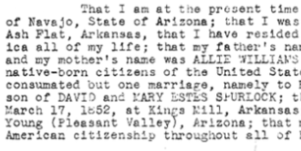
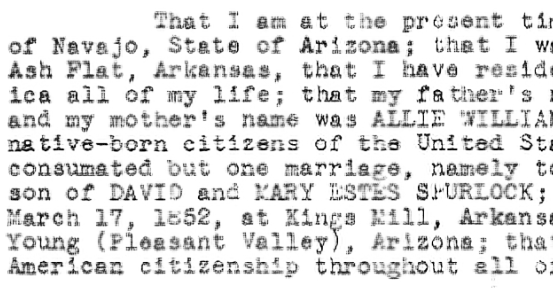
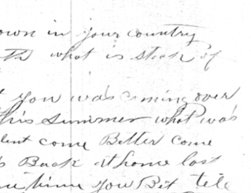
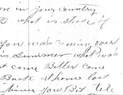
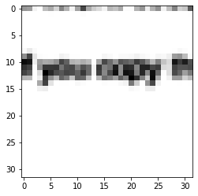
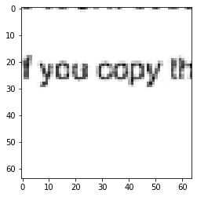

# Super Resolution GAN
## Usage
```
usage: main.py [-h] [--checkpoint CHECKPOINT] [--save_folder SAVE_FOLDER]
               [--mode MODE] [--load_state_dict LOAD_STATE_DICT]
               [--SR_factor SR_FACTOR] [--save_weights SAVE_WEIGHTS]
```

## Help Log
```
SRGAN for 2x, 4x, 8x, ...

optional arguments:
  -h, --help            show this help message and exit
  --checkpoint CHECKPOINT
                        Change the location to where the model weights are
                        stored
  --save_folder SAVE_FOLDER
                        location of folder where to save the output image in
                        string format
  --mode MODE           Mode in which to run the model
  --load_state_dict LOAD_STATE_DICT
                        Whether you want to load the state dict for the model
                        and optimizers
  --SR_factor SR_FACTOR
                        Give 2 for 2x super resolution, 4 for 4x, ...
  --save_weights SAVE_WEIGHTS
                        Whether to save the state dicts of model and optimizer
                        during training
```

## Results of Experimentation on RVL-CDIP dataset
Low Resolution\
\
High Resolution\
\
Low Resolution\
\
High Resolution\
\
Low Resolution\
\
High Resolution\
\


## References
[SRGAN](https://arxiv.org/abs/1609.04802)

## Architecture

## Loss Functions
Apart from standard Adversarial Loss(GAN Loss), content loss is used to obtain good perceptual features. 
This loss is calculated as L1 distance between the feature vectors of the two images(the generated and actual) when they are fed into the vgg net/any other feature extractor.
## Training Losses Plot

## Critical Observations
1. The size of text on the page matters. If the model is trained so as to have certain number of characters in a box of (h, w) pixels then the testing images should also have similar text size.
2. The output produced by it has lighter text than the output produced by LapSRN.
3. Repeatedly feeding the images cannot be used as a method to obtain 4x, 8x, .. using the model trained on 2x because the size of text matters.
4. 

## Implementation Details
1. Input the low resolution images to the Generator, and the Generator would output the super-resolved image, with the required SR factor​

2. Feed the SR image into Discriminator, and calculate the Adversarial loss by comparing it with the HR image​

3. To calculate the content loss, feed the SR image and HR image to a pre-trained VGG19 network, and obtain an L1 loss between the features output by the VGG19 for both of these​

4. L1 loss between ( VGG19(HR from original data)   ,  VGG19(SR from generator) )​

Add both the losses, and update the weights of generator using this combined loss​

5. How to control the SR_factor
FOR GENERATOR​

Changing the number of upsampling layers after the residual blocks​

Log(n) base 2, layers for 2^n upsampling factor​

FOR DISCRIMINATOR​

Changing the number of discriminator blocks(as each block downsamples the image to half the resolution and doubles the number of channels)​

Log(n) base 2 , blocks for 2^n sampling factor​

Change the patch_h and path_w also

6. Loss function
Perceptual Loss(on SR output of Generator) function for generator network --- ​

Perceptual loss = content loss + 10^-3   * adversarial loss​

In earlier papers prior to this, MSE loss was used, not perceptual loss​

Even if high PSNR value is achieved using MSE loss, yet the images lack high frequency details and overly smooth​

So this clearly shows that we need something superior to pixel-wise losses ​

We define and use a VGG loss function, which is takes into the euclidean distance between feature representation of SR image and the HR image​

​7. We try to minimize the above loss, so that the term in Log is maximized, meaning that the image generated by generator is very close to real image and the discriminator is fooled by it.​

​

We could also have minimized 1-log(D(G(I))) but it doesn't have a good gradient behaviour..(I didn't get that)​

8. Preparation Of Data(as in original paper)

Obtaining LR images -- ​

Bicubic kernel with downsampling factor – 2,4,8 etc​

Obtaining HR images for mini-batch​

They cropped images to 96 x 96 sub-images, similarly we can also do that​

The generator can accept images of arbitrary size as it is fully convolutional, and it will just increase the feature map by the the required SR factor. It can accept images of 1 channel also, if we make some changes to the model input parameters of generator.​


## MY SRGAN Notes
```
## Summarising SRGAN paper
### From where did the idea of perceptual loss originate?
From style transfer
### Why not bicusbic/billinear interpolation?
Features are not sharp and over-smoothened.
### If perceptual loss is not used then which one would be bette L1 or L2?
L1 due to constant gradient
### 
### Details about the various loss functions
https://towardsdatascience.com/perceptual-losses-for-image-restoration-dd3c9de4113

1. Perceptual loss :- Perceptual loss is a term in the loss function that encourages natural and perceptually pleasing results.
2. L2 loss ->>> Optimizing an image restoration method to minimize the mean per-pixel squared difference results in blurry images.
3. Problem with L2 loss ->> The problem is in the shape of the loss as it approaches zero. The closer the error is to zero, the smaller the gradient is, meaning that small deviation from the ground truth, important for sharpness is not penalized as much.

This has been a known issue for a long time with L1 used as a better alternative for image restoration. L1 has constant gradients, which means that with the loss approaching zero, the gradient will not diminish, resulting in sharper-looking images.

Let f1(n) = (x_present - x_groudn_truth)^2 --> slope = 2*(x_present - x_groudn_truth)
	f2(n) = mod((x_present - x_groudn_truth))  --> slope = 1*constant

Hence as the differnece decreases, L1 gradient doen't decrease and sharper images as compared to L2.

Even though, L1 produces sharper image, it does not weigh pixels according to their importance for perceptual quality

4. Feature losses preform better in preserving the perceptual quality. Cause they compare the features and then 

5. For generator --> perceptual loss + 10^-3 * adversarial loss

6. L2 loss is similar to MSE loss on images and results in overly smoothened features.

7. Adversarial loss is the usual loss of GANs in which images generated by the generator are compared using the discriminator.

8. In this case we use Binary Cross entropy to tell if the image is real/fake.

9. 

### Loss function for the discriminator and generator separately
For discriminator we calulage loss by summing up for real and fake images loss.
### Dealing with initially large images --  crop them into a set of small images of size for which you trained your model like if 32x32 --> 64x64 then snip boxes of size 32x32 and then path them again.


### How to control the super-resolution factor for srgan --- by changing the number of upsampling layers in G and changing the number of blocks in D

### what changes to make it suitable for 1 channel/3 channel input image --- just change the no of input channels in the G and D. also VGG loss works only in 3 channel images(so either you duplicate the fist channel to the rest of the channels or make the other two channels)

### what effect will change in dimension of input image have on the generator --  it will just change the shape of output image with the same no of channels, but the super-resolution will not be good as the weights were trained to handle images of different size. One peculiar thing is that if during the training time each window of size 32x32 contains 2-3 characters then that must be true also at the time of evaluation.

So the size of text affects the model a lot. If the text size on the page is too large or too small then the model might not be able to given good results. Do compensate of that one can try resizing the images and then snippig patches out of it.


SRGAN working---->
1. LR images are fed into the G which upsample them by 2x,4,8x depending upon the number of upsampling blocks in it
2. G can take images of any dimension but it works the best when it is given images of dimension on which it is trained on
3. The images generated by G are passed into the VGG19 NN(which is often used as classifier and in transfer learning to extract the features of image) which extracts the features of this generated(upsampled or SR) image. The original(HR) is also passed into this VGG19 to extract its features. 
4. Then loss known as perceptual loss is calculated on these two feature vectors, by using L1 loss.
5. Another loss is calculated by passing the generatred SR image through the D
6. Both of these losses are summed up to update the weights of the G


Architecture of Generator:---
1. ResNet like architecture with residual blocks and skip connections.
2. These residual blocks don't change the resolution and the no of channels but just extract the features.
3. The first conv layer before these residual blocks has a large kernel size so that it can capture a greater context and not localised features.
4. After these residual blocks+one conv layer we have the upsampling blocks. For 2x SR we have 1 upsampling block, 4x-->2 upsamplig blocks and so on.
5. The pixelshuffle layers behaves like a transConv2d layer, but with some added advantage.
6. As the architecture is fully convolutional it can take in images of any size.

Architectur of Discriminator:---
1. after one conv2d layer, there are a number of blocks. Each blocks has one downsampling layer with stride 2 and each block increases the channles by two.
2. after these blocks we have flatten and dense layers and a sigmoid at last for classification.


### Why not PSNR be taken as a metric and what is PSNR metric?
FIRst find the pixel-wise MSE error between the two images.
Then PSNR = 10.log(MAX^2/(MSE))
MAX is the maximum possible pixel value of the image.
FOR 8bit image, MAX is 255

```
​
​